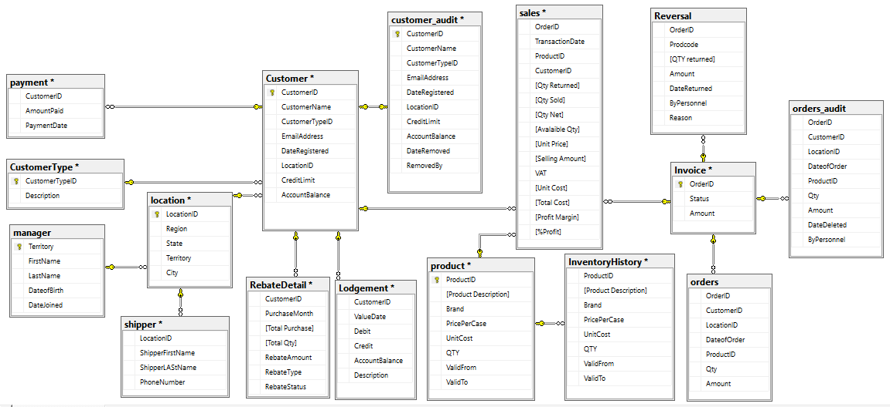

# Order Management System (OMS)

In this project, an OMS was designed, to manage and streamline the tracking of orders from inception to fulfillment and managing the people, processes and data connected to the order as it moves through its lifecycle, utilizing T-SQL for database operations and automation.

## Schema Diagram 

## Key Features 
* Stored Procedures and Functions for order processing, including order entry, updates, cancellations, and inventory management
* Triggers to enforce business rules and maintain data integrity, such as automatic inventory updates and order status tracking
* Reporting
  * Sales Reports: Detailed analysis of daily, weekly, and monthly sales.
  * Inventory Reports: Real-time inventory levels, and stock valuation.
  * Customer Reports: Customer purchase patterns, order history, Monthly Rebate Report, and credit aging report.
  * Reversal Analysis
  * Outstanding Orders
* Payment processing
* Order Placement and Fulfilment
* Returns and Refunds
* Automation: Jobs for regular data backup, report generation, and system maintenance tasks.

See [Process Flow](Process%20Flow.xlsx) for the full process flow.

## Technologies Used
* Microsoft SQL Server
* T-SQL
* Microsoft SQL Server Management Studio
* SQL Server Agent for job scheduling and automation.

## Installation and Setup
 To run this project on your machine you need to install the latest Microsoft SQL Server then follow the steps below.
 * Open and run the script [OMS Query](OMS%20Query.sql)

**Note**: The script creates the database, the Tables and programatic functionalities, so there is no need to recreate the Tables.

## Usage
After the Installation, Open the script [OMS Modules](OMS%20Modules.sql).
* Run the modules by first supply the parameters specified

## Future Enhancements
As I continue to develop and enhance the OMS, the following features are under consideration:
* User Interface (UI) for Input Collection
* Enhanced Security Features

## Contribution
We welcome contributions to these future enhancements! If you're interested in helping build the UI, improve the system's functionality, or add new features, please refer to the Contribution Guidelines for more details.
